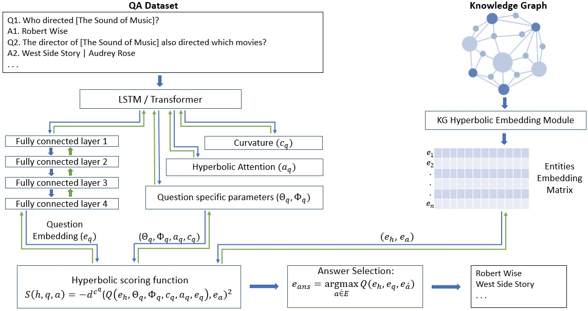

# HyperbolicKGQA
HyperKGQA proposes a technique that embeds a Knowledge Graph into the hyperbolic space  and  leverages  this  pre-trained  embeddings  to  map  questions' representation  into entities  and  relationships  space. An extensive set of experiments was run on two benchmark datasets using code published in this repository. The results show that the proposed  method  performs  better  than the state-of-the-art techniques when reasoning on arbitrary multi-hop questions over large sparse graphs.

<p align="center">

</p>

### Installation
```sh
# retrieve and install project in development mode
git clone https://github.com/colab-nyuad/Hyperbolic_KGQA.git
cd kge
pip install -e .

# set environment variables
cd ..
source set_env.sh
```
### Avilable models
This implementation includes the following models:
- [ComplEx](http://proceedings.mlr.press/v48/trouillon16.pdf)
- [RotataE](https://arxiv.org/pdf/1902.10197.pdf)
- [TransE](https://papers.nips.cc/paper/2013/file/1cecc7a77928ca8133fa24680a88d2f9-Paper.pdf)
- [Simple](https://arxiv.org/pdf/1802.04868.pdf)
- [CP](https://arxiv.org/pdf/1806.07297.pdf)
- [RESCAL](http://www.icml-2011.org/papers/438_icmlpaper.pdf)
- [DistMult](https://www.microsoft.com/en-us/research/wp-content/uploads/2016/02/ICLR2015_updated.pdf)
- [TuckER](https://arxiv.org/pdf/1901.09590.pdf)
- [RotH](https://aclanthology.org/2020.acl-main.617.pdf)
- [RefH](https://aclanthology.org/2020.acl-main.617.pdf)
- [AttH](https://aclanthology.org/2020.acl-main.617.pdf)

### Datasets
The repo presents results for two QA datasets MetaQA and WebQuestionsSP. For description of the underlying KGs please refer to the baseline paper for more details [Improving Multi-hop Question Answering over Knowledge Graphs using Knowledge Base Embeddings](https://www.aclweb.org/anthology/2020.acl-main.412/). The datasets are availbale for download [here](https://drive.google.com/file/d/1VKjZ3HxwxEpYLwqG3iD5VAJmMdyrRbZB/view?usp=sharing). Unzip KGs datasets into kge/data and QA datasets into the folder data/QA_data.

### Usage
To train and evaluate a QA task over KG, use the main.py script:

```sh
usage: main.py [-h] [--dataset DATASET] [--kg_type KG_TYPE]
              [--model {TransE,RESCAL,CP,Distmult,SimplE,RotH,RefH,AttH,ComplEx,RotatE}]
              [--hops HOPS] [--regularizer {L3}] 
              [--reg REG] [--optimizer {Adagrad,Adam}]
              [--max_epochs MAX_EPOCHS] [--valid_every VALID]
              [--dim RANK] [--patience PATIENCE]
              [--batch_size BATCH_SIZE] [--kg_batch_size KG_BATCH_SIZE]
              [--ent_dropout DROPOUT] [--rel_dropout DROPOUT]
              [--score_dropout DROPOUT] [--nn_dropout DROPOUT]
              [--learning_rate_kge LEARNING_RATE]
              [--learning_rate_kgqa LEARNING_RATE]
              [--freeze FREEZE] [--use_cuda USE_CUDA]
              [--num_workers NUM_WORKERS] [--do_batch_norm BATCH_NORM]
              [--qa_nn_type {LSTM,RoBERTa}] ---gpu GPU]
              [--use_relation_matching USE_RELATION_MATCHING]
              [--init_size INIT_SIZE] [--embeddings KG_EMBEDDINGS_PATH]
              [--labels_smoothing LABELS_SMOOTHING]
 
Knowledge Graph QA

arguments:
  -h, --help            show this help message and exit
  --dataset             Knowledge Graph dataset
  --kg_type             Type of graph (full, sparse)
  --model {TransE,RESCAL,CP,Distmult,SimplE,RotH,RefH,AttH,ComplEx,RotatE}
                        Knowledge Graph embedding model and QA score function
  --regularizer {L3}
                        Regularizer
  --reg                 Regularization weight
  --optimizer {Adagrad,Adam}
                        Optimizer
  --max_epochs
                        Maximum number of epochs
  --patience            Number of epochs before early stopping for KG embeddings
  --valid_every         Number of epochs before validation for QA task
  --dim                 Embedding dimension
  --batch_size          Batch size for QA task
  --kg_batch_size       Batch size for computing KG embeddings 
  --learning_rate_kgqa  Learning rate for QA task
  --learning_rate_kge   Learning rate for computing KG embeddings
  --hops                Number of edges to reason over to reach the answer
  --ent_dropout         Entity Dropout rate used in QA score function 
  --rel_dropout         Relation Dropout rate used in QA score function
  --score_dropout       Score Dropout rate used in QA score function
  --nn_dropout          Dropout rate for fully connected layers with RoBERTa 
  --freeze              Freeze weights of trained KG embeddings
  --use_cuda            Use gpu
  --gpu                 How many gpus to use
  --num_workers         Number of workers for parallel computing 
  --do_batch_norm       Do batch normalization for ComplEx and RotatE
  --labels_smoothing    Labels smoothing
  --init_size           Initial embeddings' scale for hyperbolic embeddings
  --embeddings          Path to the folder with computed embeddings for KG
  --qa_nn_type {LSTM,RoBERTa}
                        Which NN to use for question embeddings
  --use_relation_matching 
                        Use relation matching for postprocessing candidates in QA task
```

Running the script main.py computes KG embeddings using [LibKGE](https://github.com/uma-pi1/kge) and QA task over KG. To compute the embeddings using LibKGE, training parameters (learning_rate, batch_size, optimizer_type, dropout, normalization_metric and etc.) need to be specified in a config file. The script checks if there is an uploaded config file in the fomrat \<dataset\>\_\<kg_type\>\_\<model\>\_\<dim\> in the folder kge/data/config_files/<dataset> to use for training embeddings. If the file not found, the config will be created from the input arguments. Following is an example command to run tarining KG embedding and QA task for sparse MetaQA dataset, dimension 200, AttH model and 1hop questions: 

```
python main.py --dataset MetaQA --model AttH --dim 400 --kg_type half --valid_every 5 \--max_epochs 200 --learning_rate_kgqa 0.0002 --hops 1
```

For Freebase:
```
python main.py --dataset fbwq --model ComplEx --dim 50 --kg_type full --valid_every 10 \--max_epochs 200 --learning_rate_kgqa 0.00002 
--freeze True --do_batch_norm True \--batch_size 16 --labels_smoothing 0.05 --qa_nn_type RoBERTa
```
  
To use already pretrained embeddings, please specifiy the path to the folder with files checkpoint_best.pt, entity_ids.del and relation_ids.del:

```
python main.py --dataset MetaQA --embeddings data/pretrained_models/embeddings/MetaQA/AttH_MetaQA_half_400/ \--model AttH --dim 400 
--kg_type half --valid_every 5 --max_epochs 200 \--learning_rate_kgqa 0.0002 --hops 3
```


  
### Relation matching 
 
 
### Experiments
 

### How to cite
