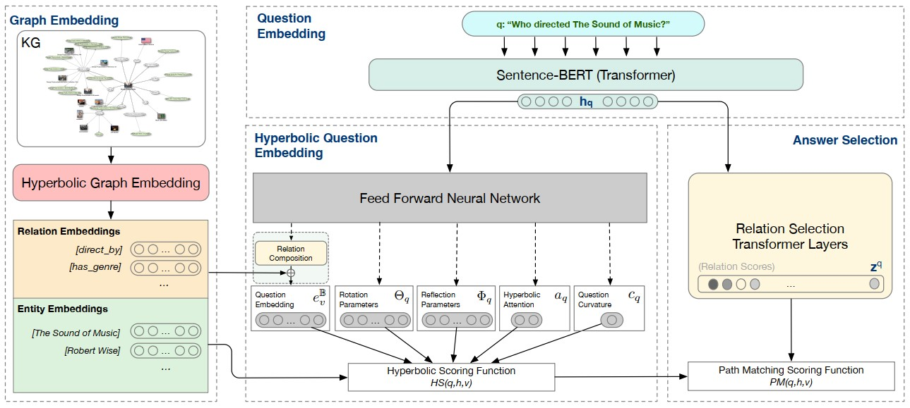

# HyperKGQA: Question Answering over Knowledge Graphs using Hyperbolic Representation Learning

HyperKGQA proposes a technique that embeds a Knowledge Graph into the hyperbolic space  and  leverages  this  pre-trained  embeddings  to  map  questions' representation  into entities  and  relationships  space. An extensive set of experiments was run on two benchmark datasets using code published in this repository. The results show that the proposed  method  performs  better  than the state-of-the-art techniques when reasoning on arbitrary multi-hop questions over large sparse graphs.


*HyperKGQA architecture for question answering including the (i) knowledge graph embedding, (ii) AttH question embedding, (iii) Hyperbolic Question Embedding (with an optional Relation Composition component that we evaluate separately), and (iv) Answer Selection (with path matching).*

### Quick start
```sh
# retrieve and install project in development mode
git clone https://github.com/colab-nyuad/HyperKGQA.git
cd kge
pip install -e .

# set environment variables
cd ..
source set_env.sh
```

## Table of contents
1. [Data](#data)
2. [Parameters](#usage)
3. [Computing embeddings](#emb)
4. [Run KGQA](#kgqa)
5. [Results](#results)

## Data <a name="data"></a>

The repo presents results for two QA datasets MetaQA and WebQuestionsSP. MetaQA dataset with its underlying KG can be downloaded [from](https://github.com/yuyuz/MetaQA). WebQuestionsSP dataset is available for download in json format from [here](https://www.microsoft.com/en-us/download/details.aspx?id=52763). The underlying KG for WebQuestionsSP was selected as a subset of Freebase KG with following running Page Rank algorithm to reduce the size of the graph. For the detailed description on this and download please refer to the baseline paper [Improving Multi-hop Question Answering over Knowledge Graphs using Knowledge Base Embeddings](https://www.aclweb.org/anthology/2020.acl-main.412/). Please unzip KGs datasets (train, valid and test files) into <em>kge/data/dataset_name</em> and <em>kg_data/dataset_name</em> and QA datasets (train, valid and test files) into the folder <em>qa_data/dataset_name</em>.

## Parameters <a name="usage"></a>
To train and evaluate a QA task over KG, use the main.py script:

```sh
usage: main.py [-h] [--dataset DATASET] [--kg_type KG_TYPE]
              [--model {TransE,RESCAL,CP,Distmult,SimplE,RotH,RefH,AttH,ComplEx,RotatE}]
              [--hops HOPS] [--regularizer {L3}] 
              [--reg REG] [--optimizer {Adagrad,Adam}]
              [--max_epochs MAX_EPOCHS] [--valid_every VALID]
              [--dim RANK] [--patience PATIENCE]
              [--batch_size BATCH_SIZE]
              [--learning_rate LEARNING_RATE]
              [--freeze FREEZE] [--use_cuda USE_CUDA]
              [--num_workers NUM_WORKERS]
              [--qa_nn_type {LSTM,RoBERTa}] ---gpu GPU]
              [--use_relation_matching USE_RELATION_MATCHING]
              [--labels_smoothing LABELS_SMOOTHING]
 
Knowledge Graph QA

arguments:
  -h, --help            show this help message and exit
  --dataset             Knowledge Graph dataset
  --kg_type             Type of graph (full, sparse)
  --model {TransE,RESCAL,CP,Distmult,SimplE,RotH,RefH,AttH,ComplEx,RotatE}
                        Knowledge Graph embedding model and QA score function
  --regularizer {L3}
                        Regularizer
  --reg                 Regularization weight
  --optimizer {Adagrad,Adam}
                        Optimizer
  --max_epochs
                        Maximum number of epochs
  --patience            Number of epochs before early stopping for KG embeddings
  --valid_every         Number of epochs before validation for QA task
  --dim                 Embedding dimension
  --batch_size          Batch size for QA task 
  --learning_rate       Learning rate for QA task
  --hops                Number of edges to reason over to reach the answer 
  --freeze              Freeze weights of trained KG embeddings
  --use_cuda            Use gpu
  --gpu                 How many gpus to use
  --num_workers         Number of workers for parallel computing 
  --labels_smoothing    Labels smoothing
  --qa_nn_type {LSTM,RoBERTa}
                        Which NN to use for question embeddings
  --use_relation_matching 
                        Use relation matching for postprocessing candidates in QA task
```

Running the script main.py computes KG embeddings using [LibKGE](https://github.com/uma-pi1/kge) and QA task over KG. To compute the embeddings using LibKGE, training parameters (learning_rate, batch_size, optimizer_type, dropout, normalization_metric and etc.) need to be specified in a config file. The script checks if there is an uploaded config file in the fomrat: \<dataset\>\_\<kg_type\>\_\<model\>\_\<dim\> in the folder kge/data/config_files/<dataset> to use for training embeddings. If the file not found, the config will be created from the input arguments. 

## Computing embeddings <a name="emb"></a>

## Run KGQA <a name="kgqa"></a>


Following is an example command to run tarining KG embedding and QA task for sparse MetaQA dataset, dimension 200, AttH model and 1hop questions: 

```sh
python main.py --dataset MetaQA --model AttH --dim 400 --kg_type half --valid_every 5 --max_epochs 200 \
--learning_rate_kgqa 0.0002 --hops 1 --qa_nn_type LSTM
```

For Freebase:
```sh
python main.py --dataset fbwq --model ComplEx --dim 50 --kg_type full --valid_every 10 --max_epochs 200 \
--learning_rate_kgqa 0.00002 --freeze True --batch_size 16 --qa_nn_type RoBERTa
```
  
To use already pretrained embeddings, please specifiy the path to the folder with files checkpoint_best.pt, entity_ids.del and relation_ids.del:

```sh
python main.py --dataset MetaQA --embeddings data/pretrained_models/MetaQA/AttH_MetaQA_half_400/ \
--model AttH --dim 400 --kg_type half --valid_every 5 --max_epochs 200 --learning_rate_kgqa 0.0002 --hops 3 \
--qa_nn_type LSTM
```
  
Compute performance with relation matching:
```sh
python main.py --dataset fbwq --model RefH --dim 400 --kg_type half --valid_every 10 --max_epochs 200 \
--learning_rate_kgqa 0.00002 --freeze True --batch_size 16 --qa_nn_type RoBERTa --use_relation_matching True
```
  
## Results <a name="results"></a>
All results on KGQA are available in the manuscript. Please refer to the Tables 3-7. Here we present the results on Link Prediction:
<table>
    <thead>
        <tr>
            <th>Layer 1</th>
            <th>Layer 2</th>
            <th>Layer 3</th>
        </tr>
    </thead>
    <tbody>
        <tr>
            <td rowspan=4>L1 Name</td>
            <td rowspan=2>L2 Name A</td>
            <td>L3 Name A</td>
        </tr>
        <tr>
            <td>L3 Name B</td>
        </tr>
        <tr>
            <td rowspan=2>L2 Name B</td>
            <td>L3 Name C</td>
        </tr>
        <tr>
            <td>L3 Name D</td>
        </tr>
    </tbody>
</table>

## How to cite
